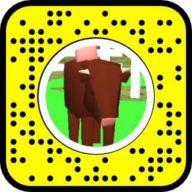

# XR

### AR

### Interactive Media Class

Farm Animal Snapchat Lens

[Snapchat Video (2).mp4](XR/Snapchat_Video_(2).mp4)

Furniture Placement Lens -  3.4M views!

[Snapchat-1064081822.mp4](XR/Snapchat-1064081822.mp4)

Paper sailboat lens

[Snapchat Video (1).mp4](XR/Snapchat_Video_(1).mp4)

Retro song radio lens

[Screen Recording Feb 24 2021 from Google Photos.mp4](XR/Screen_Recording_Feb_24_2021_from_Google_Photos.mp4)

### VR

Technology: Photoshop, audacity, polycam or other 3d viewer. 

For this image, I first created the scene in photoshop and then exported the image to Audacity, an audio editor. There, I was able to manipulate the raw data of the image to create the distortions you see now. 

[https://panoraven.com/en/embed/LtyX6M4M7S](https://panoraven.com/en/embed/LtyX6M4M7S)

Photogrammetry

Technology: meshmixer, blender, polycam

Missing: images/videos of using OpenBrush to create scene in this room.

[https://skfb.ly/oqFRP](https://skfb.ly/oqFRP)

[https://skfb.ly/6YVVv](https://skfb.ly/6YVVv)